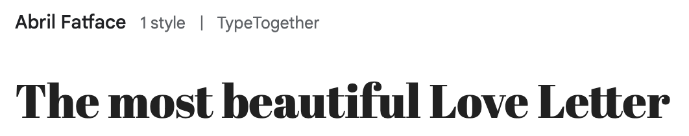
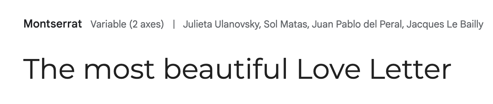
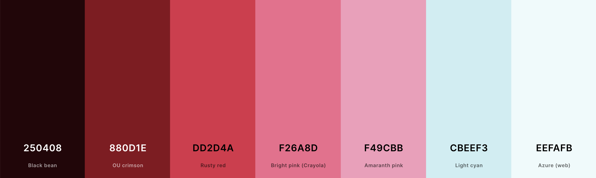

# love-letter-generator
Generate your very own love letter for your loved ones.

## Contents

- [love-letter-generator](#love-letter-generator)
  - [Contents](#contents)
  - [Surface](#surface)
    - [Fonts](#fonts)
    - [Color Palette](#color-palette)
  - [Design](#design)
  - [Project Management (Agile Development)](#project-management-agile-development)
  - [Deployment](#deployment)
  - [Technologies Used](#technologies-used)

## Surface
### Fonts
For the heading font, we used Abril Fatface.

  

For the body font, we used Montserrat.

  

### Color Palette
The fun and festive color palette was generated with [Coolors](https://coolors.co/).

  

## Design

The UX design was made in balsamiq. See the wireframes [here](assets/PDF/LoveLetterGenerator.pdf)

## Project Management (Agile Development)

We have been using [GitHub projects](https://github.com/users/lucia2007/projects/10/views/1) for organizing our project and tracking user stories/issues. It is a very helpful tool which enabled us to keep all the PBIs in one place and to tackle the issues gradually and to keep an eye on our progress.

At the beginning of the project, we first spent some time on brainstorming, project planning, splitting roles and tasks, on thinking the project through. We agreed to keep it simple, to focus on the MVP and to add more complex or nice to have features if we had extra time. Creating wireframes and choosing the basic design options (fonts, color scheme) helped us get started fast. 

PBis were organized in a To Do section. Each of the items was assigned a priority and one of the MoSCoW tags. Whenever we were working on a task, we moved it into "In Progress" section and when the issue was done, we moved the card to "Done". 

In a longer project we would have written out detailed User stories, categorized them in Epics and Milestones and planned out our Sprints, but this was not necessary or feasible for the hackathon style project. It would have been good to assign the tasks story points to each issue to keep the complexity of the tasks in mind.

From the beginning we tried to update the readme and testing files, especially as regards credits, sources and bug-fixes.

As you will see from our progress, we always kept MVP in mind. At first we made sure the basic features were in place so we could start working (setting up the workplace, inviting collaboratos, setting up the project board, creating the index page, adding css and js files, creating wireframes and choosing design options), then we focused on the main elements and when we had some extra time, we added some nice to have features, but always keeping in mind meeting the core project requirements first.

Overall, primarily, we focused on completing majority of the must-haves, in later stages of the product development we would consider some should and could-haves. If an issue was identified as a won't have, it was moved into the respective column.

Breaking the project up into issues and essentially into tasks, assigning them to individual team members, trakcing progress in Projects was very helpful and enabled us to tackle the project quickly in managable bite-size steps.

The Project tool was very benefitial for our development process, especially because we could rely on having all the relevant information in one place.

[Project Board](./assets/readme-images/project-board.png)

Back to top

## Deployment

This page was deployed using [github pages](https://pages.github.com/)

## Technologies Used

- The favicon was generated with [Favicon Generator](https://favicon.io/favicon-converter/)
