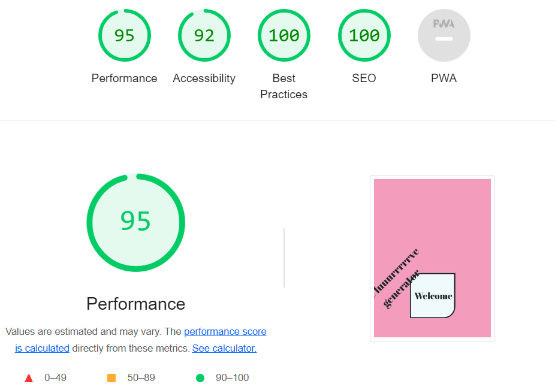
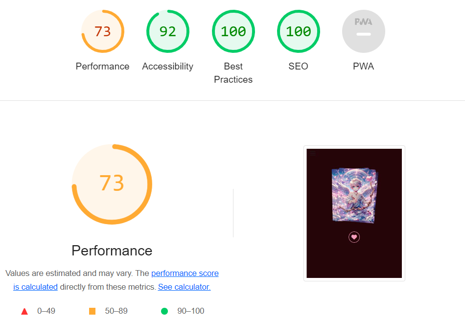
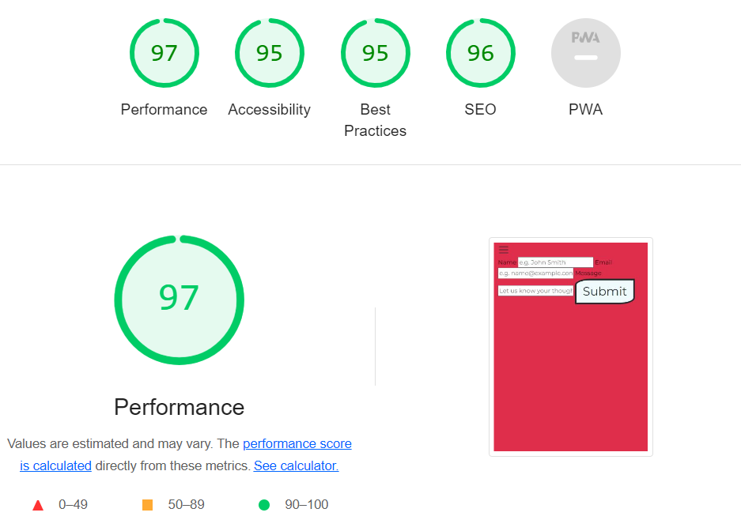
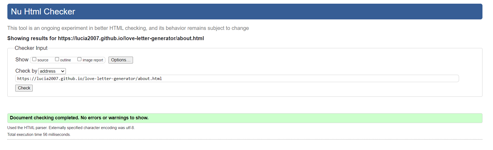
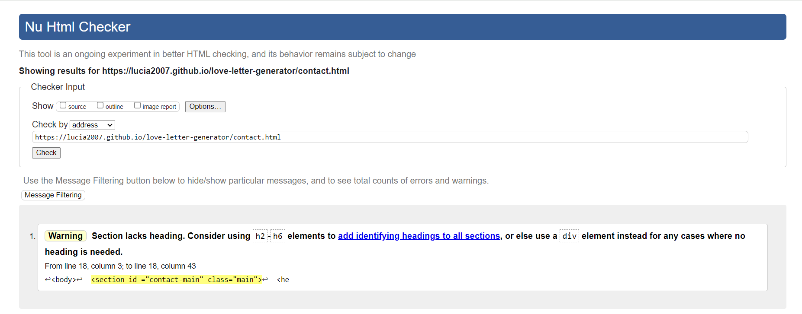

## Contents

* [Automated Testing](#automated-testing)
  * [Lighthouse](#lighthouse)
  * [W3C](#W3C)
* [Manual Testing](#manual-testing)
  * [Welcome Page](#welcome-page)
  * [Main Form](#main-form)
  * [About Page](#about-page)
  * [Contact Page](#contact-page)
  * [Header](#header)
  * [Footer](#footer)

## Automated Testing

### Lighthouse 

#### Home Page (as of 17/02/2024)

#### About Page (as of 17/02/2024)

#### Contact Page (as of 17/02/2024)

### W3C 

#### Home Page 

#### About Page 

#### Contact Page (as of 17/02/2024)

N.B. The section that triggered the warning will /can be removed when contact page is styled. The form is only nested inside the section so the header and background-color match the home page. If the whole site is laid out vertically, this section will not be required. 

## Manual Testing

### Welcome Page

| Feature | Expected Outcome | Testing Performed | Result | Pass/Fail |
| --- | --- | --- | --- | --- |
| Welcome button | Scrolls to main form when clicked | Clicked welcome button | Page scrolls to main form | Pass

### Main Form

| Feature | Expected Outcome | Testing Performed | Result | Pass/Fail |
| --- | --- | --- | --- | --- |
| Letter type dropdown | Allows user to select letter type | Selected each letter type | Form proceeds with correct letter type selected | Pass |
| Partner's Name input field | Allows user to input text | Input text | Allowed text input | Pass |
| Noun 1 input field | Allows user to input text | Input text | Allowed text input | Pass |
| Noun 1 Randomizer | Generates a random noun when clicked and populates noun 1 input field | Clicked randomizer button | Populates noun 1 input field with random noun | Pass |
| Noun 2 input field | Allows user to input text | Input text | Allowed text input | Pass |
| Noun 2 Randomizer | Generates a random noun when clicked and populates noun 2 input field | Clicked randomizer button | Populates noun 1 input field with random noun | Pass |
| Eye Color field | Allows user to input text | Input text | Allowed text input | Pass |
| Adjective 1 input field | Allows user to input text | Input text | Allowed text input | Pass |
| Adjective 1 Randomizer | Generates a random adjective when clicked and populates Adjective 1 input field | Clicked randomizer button | Populates adjective 1 input field with random adjective | Pass |
| Adjective 2 input field | Allows user to input text | Input text | Allowed text input | Pass |
| Adjective 2 Randomizer | Generates a random adjective when clicked and populates Adjective 2 input field | Clicked randomizer button | Populates adjective 2 input field with random adjective | Pass |
| Your Name input field | Allows user to input text | Input text | Allowed text input | Pass |
| Generate button | Generates letter if all input fields have been completed | Completed all fields and clicked Generate button | Letter generated with all fields displayed as entered | Pass |
| Generate button | Will not allow user to proceed if Partner's Name is not entered | Tried to generate letter without inputting Partner's Name | Letter not generated and prompted to input text in the blank input field | Pass |
| Generate button | Will not allow user to proceed if Noun 1 is not entered | Tried to generate letter without inputting Noun 1| Letter not generated and prompted to input text in the blank input field | Pass |
| Generate button | Will not allow user to proceed if Noun 2 is not entered | Tried to generate letter without inputting Noun 2| Letter not generated and prompted to input text in the blank input field | Pass |
| Generate button | Will not allow user to proceed if Eye Color is not entered | Tried to generate letter without inputting Eye Color | Letter not generated and prompted to input text in the blank input field | Pass |
| Generate button | Will not allow user to proceed if Adjective 1 is not entered | Tried to generate letter without inputting Adjective 1 | Letter not generated and prompted to input text in the blank input field | Pass |
| Generate button | Will not allow user to proceed if Adjective 2 is not entered | Tried to generate letter without inputting Adjective 2 | Letter not generated and prompted to input text in the blank input field | Pass |
| Generate button | Will not allow user to proceed if Your Name is not entered | Tried to generate letter without inputting Your Name | Letter not generated and prompted to input text in the blank input field | Pass |
| Clear button | Resets all form fields | Clicked clear button | All form fields were reset | Pass

### Letter section 

| Feature | Expected Outcome | Testing Performed | Result | Pass/Fail |
| --- | --- | --- | --- | --- |
| Platonic button | Displays the platonic letter template, including user input | Clicked Platonic button | Platonic template displayed correctly | Pass |
| Romantic button | Displays the romantic letter template, including user input | Clicked Romantic button | Romantic template displayed correctly | Pass |
| Monogamous button | Displays the monogamous letter template, including user input | Clicked Monogamous button | Monogamous template displayed correctly | Pass |
| Polyamorous button | Displays the polyamorous letter template, including user input | Clicked Polyamorous button | Polyamorous template displayed correctly | Pass |
| Download button - Platonic Letter | Downloads correct letter type | Clicked download button | Correct letter type downloaded | Pass |
| Download button - Romantic Letter | Downloads correct letter type | Clicked download button | Correct letter type downloaded | Pass |
| Download button - Monogamous Letter | Downloads correct letter type | Clicked download button | Correct letter type downloaded | Pass |
| Download button - Polyamorous Letter | Downloads correct letter type | Clicked download button | Correct letter type downloaded | Pass |

### About Page

| Feature | Expected Outcome | Testing Performed | Result | Pass/Fail |
| --- | --- | --- | --- | --- |
| Card deck: hover | Deck of creator cards fan out when hovered | Hovered mouse over deck | Cards fanned out | Pass |
| Heart button | Opens creator card deck | Clicked heart button | Creator deck opened | Pass |
| Forward button | Scrolls forward through each creators cards | Clicked forward button | Scrolled forward through cards | Pass |
 Back button | | Scrolls back through each creators cards | Clicked back button | Scrolled back through cards | Pass |
 | Individual creator cards: hover | Individual creator cards fan out when hovered | Hovered mouse over deck | Individual cards fanned out | Pass |

### Contact Page

| Feature | Expected Outcome | Testing Performed | Result | Pass/Fail |
| --- | --- | --- | --- | --- |
| Name input field | Allows user to input text | Input text | Allowed text input | Pass |
| Email input field | Allows user to input text | Input text | Allowed text input | Pass |
| Text area | Allows user to input text | Input text | Allowed text input | Pass |
| Submit button | Will not allow user to proceed if all input fields are not complete | Clicked submit button with empty fields | User prompted to complete all fields | Pass |
| Submit button | Allow user to submit form and displays success message | Clicked submit button with all fields complete | Form submitted and success message displayed | Pass |
| Submit button | Sends email to user after form submission | Clicked submit button with all fields complete | Form submitted and email received | Pass |

### Header

| Feature | Expected Outcome | Testing Performed | Result | Pass/Fail |
| --- | --- | --- | --- | --- |
| Home button | Navigates back to welcome page | Clicked Home button | Welcome page loaded | Pass |
| New Letter button | Clears completed form fields | Clicked New Letter button | All input fields cleared | Pass |
| About button | Navigates to about page | Clicked About button | About page loaded | Pass |
| Contact Us button | Navigates to Contact Us page | Clicked Contact us button | Contact Us page loaded | Pass | 

### Footer

| Feature | Expected Outcome | Testing Performed | Result | Pass/Fail |
| --- | --- | --- | --- | --- |
Footer link 1 | Loads https://github.com/emilyrosenberg in new window | Clicked footer link 1 | Correct page loaded in new window | Pass |
Footer link 2 | Loads https://github.com/JohnnySonTrinh in new window | Clicked footer link 2 | Correct page loaded in new window | Pass |
Footer link 3 | Loads https://github.com/caleom in new window | Clicked footer link 3 | Correct page loaded in new window | Pass |
Footer link 4 | Loads https://github.com/lucia2007 in new window | Clicked footer link 4 | Correct page loaded in new window | Pass |
Footer link 5 | Loads https://github.com/Cleg83 in new window | Clicked footer link 5 | Correct page loaded in new window | Pass |
Footer link 6| Loads https://github.com/msamarpanraj in new window | Clicked footer link 6 | Correct page loaded in new window | Pass |
Footer links hover: mouse in from top or bottom | Each footer link has a "shutter-out" style hover effect beneath it when hovered | Hovered over each footer link: mouse in from top and bottom | Correct effect shown | Pass |
Footer links hover: mouse in from left | All footer links except footer link 1 have a "swipe-from-left" style effect beneath it when hovered | Hovered over each footer link: mouse in from left | Correct effect shown | Pass |
Footer links hover: mouse in from right| All footer links except footer link 6 have a "swipe-from-right" style effect beneath it when hovered | Hovered over each footer link: mouse in from right | Correct effect shown | Pass |